# Архитектура продукта Voice

Источник истины по архитектуре. Код не является частью этого документа.

**Продукт:** Voice — AI Voice Input Assistant (уровень Aqua Voice / Raycast AI).  
**Платформа MVP:** Windows desktop. macOS / mobile / web — позже, без смены доменного ядра.  
**LLM MVP:** только DeepSeek API. Anthropic/Claude не используются.  
**Разработка:** Cursor IDE. Cursor также — приоритетный target-app для диктовки (`AppCategory.ide`).

**Инвариант:** бизнес-логика диктовки живёт в shared contracts/domain; desktop и backend — адаптеры. Замена backend-языка или ASR-провайдера не требует переписывания UI и OS-интеграции.

### Текущее состояние реализации

| Фаза | Статус |
|------|--------|
| M0 Foundation | **Done** — monorepo, contracts/sdk, FastAPI `/v1`, Tauri Windows shell + pipeline stub |
| M1 Audio + Hotkey | **Done** — cpal WASAPI capture, Ctrl+Shift+Space PTT, live peak meter |
| M2 ASR | **Done** — WAV encode + `/v1/ai/asr` (Whisper / Deepgram) |
| M3 Refine + Inject + History | **Done** — DeepSeek refine, clipboard inject, SQLite history, app context |

---

## 1. Product Architecture Overview

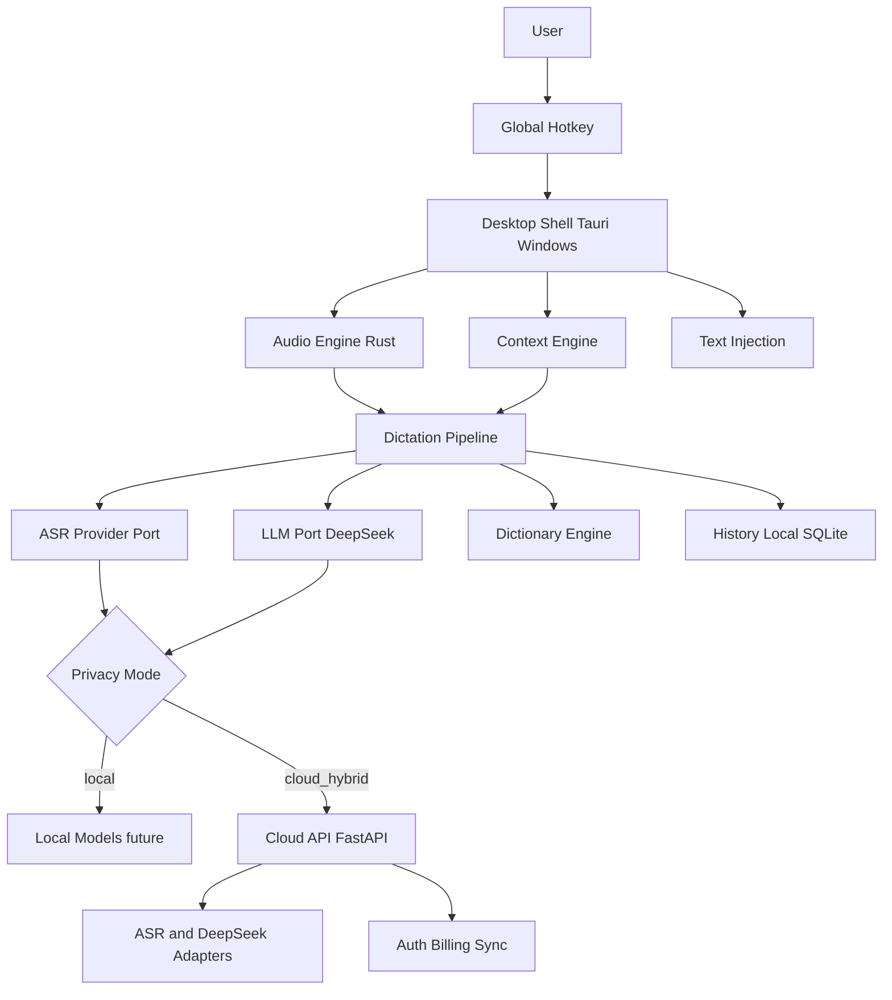

**Основной сценарий:** удержание hotkey → речь → ASR → AI refine (DeepSeek) → вставка текста в активное приложение за целевые &lt;800 ms E2E.

**Слои продукта:**

| Слой | Назначение |
|------|------------|
| Interaction | Hotkeys, overlay, settings, history UI |
| Capture | Mic, VAD, streaming, preprocessing |
| Understand | ASR + dictionary + context |
| Refine | DeepSeek post-processing с guardrails |
| Deliver | Text injection + history |
| Account | Auth, billing, sync, enterprise (cloud) |

---

## 2. System Architecture

### 2.1 Топология

| Компонент | Роль | Runtime |
|-----------|------|---------|
| `apps/desktop` | OS shell, UI, hotkeys, injection | Tauri v2 (Rust + React), Windows first |
| `services/api` | Auth, billing, sync, profiles | FastAPI / Python |
| `services/ai-gateway` | ASR + DeepSeek orchestration | FastAPI |
| `packages/*` | Contracts, domain types, SDK | TS / OpenAPI |
| Local SQLite | History, dictionary, instructions | Desktop |
| PostgreSQL | Users, subscriptions, org, audit | Cloud |
| Redis | Rate limit, cache, queues | Cloud |
| Windows Credential Manager | Tokens, API keys | Desktop |

### 2.2 Privacy modes

| Mode | Audio | ASR | LLM | History | Sync |
|------|-------|-----|-----|---------|------|
| **Local** | device | local ASR (V1+) | local / skip refine | local only | off |
| **Hybrid** | device; ephemeral upload opt | cloud ASR | DeepSeek cloud | local; sync opt-in | opt-in |
| **Cloud** | stream to gateway | cloud ASR | DeepSeek | local + sync | on |

Аудио в cloud: ephemeral by default (память, TTL, без диска). Enterprise: Zero Data Retention.

### 2.3 Границы

- Desktop владеет: capture, hotkeys, injection, SQLite, Credential Manager.
- Backend владеет: identity, billing, platform keys, sync, analytics, enterprise policy.
- Backend не содержит Win32-логики — только DTO `AppContext`.

---

## 3. Desktop Architecture

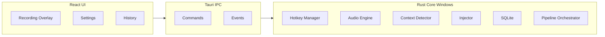

### 3.1 Процессы

- **UI thread:** React, Zustand, TanStack Query.
- **Rust core:** hotkeys, audio, pipeline, injection — не блокирует UI.
- **Worker threads:** DSP, VAD, encode/stream.
- **IPC:** typed commands + events (`partial_transcript`, `final_text`, `error`).

### 3.2 Feature modules

| Module | Ответственность |
|--------|-----------------|
| `hotkeys` | PTT / Toggle / Hands-free |
| `audio` | Mic, stream, VAD, noise |
| `pipeline` | Dictation session orchestration |
| `context` | Frontmost app → `AppContext` |
| `inject` | Windows text insertion strategies |
| `history` | Local CRUD |
| `dictionary` | Dictionary apply |
| `instructions` | Global / per-app / context |
| `privacy` | Mode enforcement |
| `updater` | Auto-update |
| `telemetry` | Opt-in metrics |

### 3.3 Text injection (Windows MVP)

Контракт `TextInjector`, порядок fallback:

1. Clipboard + Ctrl+V (default)
2. UI Automation insert text
3. SendInput key events (last resort)

Разрешения: микрофон + Accessibility/UI Automation — онбординг.

macOS (позже): отдельный adapter `MacOsTextInjector`, тот же порт.

### 3.4 UX Architecture

- Tray + overlay только во время записи.
- Overlay: waveform, partial text, latency, Esc = cancel.
- Onboarding: mic → a11y → hotkey → первая успешная диктовка.
- Failure: не silent fail — toast + retry + вставка сырого ASR.
- Motion: 2–3 микроанимации (appear, waveform, success).

---

## 4. Backend Architecture

### 4.1 Слои (Clean / Hexagonal / DDD)

```
services/api/
  domain/
  application/       # use cases
  ports/             # AsrPort, LlmPort, BillingPort, ...
  adapters/
    persistence/     # SQLAlchemy + Alembic
    ai/              # DeepSeek, ASR adapters
    http/            # FastAPI
    auth/
  infrastructure/
```

### 4.2 Bounded contexts

| Context | Aggregates |
|---------|------------|
| Identity | User, Session, ApiKey |
| Billing | Subscription, UsageMeter, Invoice |
| AI Gateway | ProviderConfig, InferenceJob |
| Sync | Device, SyncCursor, EncryptedBlob |
| Organization | Org, Member, Policy, AuditLog |
| Analytics | Event (без PII) |

### 4.3 Замена языка backend

Клиент зависит только от `/v1` в `packages/contracts`. Python можно заменить без изменения desktop.

---

## 5. AI Architecture

### 5.1 Pipeline

```
AudioFrames → Preprocess → VAD → ASR(stream) → DictionaryBoost
  → RawTranscript → ContextPack → InstructionResolver
  → DeepSeek Refine (guardrails) → FinalText → Inject + History
```

### 5.2 Guardrails refine (обязательно)

AI **не должен:** менять смысл, сокращать, добавлять факты, менять код, camelCase, CLI, URL, email, markdown.

AI **должен:** пунктуация, грамматика, форматирование, применение user instructions без нарушения preservation.

Output: `{ text, confidence, applied_rules[], warnings[] }`.

### 5.3 Context pack

```ts
interface ContextPack {
  appId: string;
  appCategory: AppCategory; // ide | chat | email | browser | docs | other
  windowTitle?: string;
  locale: string;
  privacyMode: PrivacyMode;
  instructions: ResolvedInstructions;
  dictionaryHints: DictionaryEntry[];
  rawTranscript: string;
}
```

Screen OCR — V2, порт `ScreenContextPort` зарезервирован.

### 5.4 LLM

MVP: **только DeepSeek API** через `LlmProvider`.  
Не используем: Anthropic, Claude, OpenAI LLM (OpenAI допустим только как ASR, если выбран Whisper/Realtime).

---

## 6. Audio Pipeline Architecture

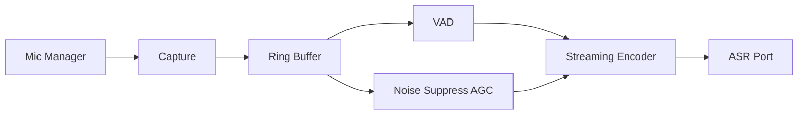

**Бюджеты:**

| Метрика | Цель |
|---------|------|
| Record start | &lt;50 ms |
| First partial | &lt;300 ms |
| E2E final | &lt;800 ms P50; &lt;1.5 s P95 |
| App startup (shell) | &lt;500 ms |

Модули Rust: `MicDevice`, `CaptureSession`, `VadEngine`, `Preprocessor`, `AudioStreamer`, `SessionClock`.

---

## 7. Provider System Design

### 7.1 Ports

```ts
interface AsrProvider {
  id: ProviderId;
  capabilities: { streaming: boolean; languages: string[]; local: boolean };
  transcribeStream(input: AudioStream, opts: AsrOptions): AsyncIterable<AsrPartial>;
  transcribeFile(input: AudioBuffer, opts: AsrOptions): Promise<AsrResult>;
}

interface LlmProvider {
  id: ProviderId;
  refine(input: RefineRequest): Promise<RefineResult>;
}

interface SignalEnhancer {
  enhance(audio: AudioBuffer): Promise<EnhancedAudio>;
}
```

### 7.2 Registry

`ProviderRegistry` + `ProviderRouter` (privacy, latency, language, cost, health).  
Новый провайдер = adapter + registry entry, без изменения pipeline.

### 7.3 Providers

| Kind | MVP | Later |
|------|-----|-------|
| ASR | OpenAI Realtime/Whisper и/или Deepgram | AssemblyAI, Gladia, DeepSig enhance, Whisper.cpp, MLX |
| LLM | **DeepSeek only** | другие — только по явному решению + ADR |
| Signal | DeepSig optional | — |

---

## 8. Monorepo Structure

**Tooling:** pnpm workspaces + Turborepo + Changesets. Python: `uv` в `services/`.

```
voice/
  apps/
    desktop/                 # Tauri v2 + React + Vite (Windows first)
  services/
    api/
    ai-gateway/
  packages/
    contracts/
    domain-types/
    sdk/
    eslint-config/
    tsconfig/
  crates/
    audio-core/              # optional shared Rust
  docs/
  .project/
  infrastructure/
  .github/workflows/
```

---

## 9. Feature Map

| Feature | MVP | V1 | V2 | Enterprise |
|---------|-----|----|----|------------|
| Windows PTT + inject | x | | | |
| Toggle / Hands-free | | x | | |
| Cloud ASR + DeepSeek refine | x | | | |
| Local / Hybrid mode | | x | | |
| Global instructions | x | per-app | context | org |
| Dictionary | basic | categories | pronunciation | team |
| History local | x | search/fav | cloud sync | retention |
| Context engine | app category | deep IDE | screen OCR | |
| macOS | | x | | |
| iOS / Android / Web | | | x | MDM |
| SSO / SCIM / ZDR / audit | | | | x |

---

## 10. Domain Models

**Desktop / shared:**

- `DictationSession` — id, startedAt, mode, appContext, status, metrics
- `Transcript` — raw, partials[], final, language, provider
- `RefinedText` — text, rulesApplied, provider (`deepseek`)
- `DictionaryEntry` — term, pronunciations[], priority, category
- `Instruction` — scope (`global` \| `app` \| `context`), body, priority
- `HistoryItem` — sessionId, text, appId, tags, favorite
- `AppContext` — appId, category, windowTitle
- `UserPreferences` — hotkeys, privacyMode, asrProvider
- `ProviderBinding` — capability → providerId

**Cloud:** User, Subscription, UsageRecord, Organization, Policy, AuditEvent, SyncEnvelope.

**Categories словаря:** names, companies, programming, apis, cli, brands.

---

## 11. Database Schema

### 11.1 Local SQLite (Drizzle)

- `history_items(id, session_id, text, raw_text, app_id, created_at, favorite, deleted_at)`
- `dictionary_entries(id, term, pronunciations_json, priority, category, notes)`
- `instructions(id, scope, scope_key, body, priority, enabled)`
- `sessions(id, status, privacy_mode, metrics_json, created_at)`
- `settings_kv(key, value_encrypted)`
- FTS5 на `history_items.text`

### 11.2 PostgreSQL

- `users`, `identities`, `devices`
- `subscriptions`, `plans`, `usage_meters`
- `orgs`, `org_members`, `org_policies`
- `audit_logs`
- `sync_blobs`
- `provider_configs` (ключи через KMS)

---

## 12. API Design

**Base:** `/v1` (frozen). Breaking → `/v2`.

**Auth:** OAuth2/OIDC + JWT access + refresh.

**Endpoints (ядро):**

- `POST /v1/auth/login`, `POST /v1/auth/refresh`
- `GET /v1/me`, `PATCH /v1/me/preferences`
- `POST /v1/ai/asr/stream` → WebSocket
- `POST /v1/ai/refine` (+ SSE) — backend → DeepSeek
- `GET/PUT /v1/sync/dictionary`, `.../instructions`, `.../history`
- `GET /v1/billing/usage`, `POST /v1/billing/checkout`
- Enterprise: `GET /v1/org/audit`, SSO

**WS ASR:** `audio_chunk | config | stop` ↔ `partial | final | error | usage`

**Errors:** `{ code, message, retryable, request_id }`

---

## 13. Component Diagram

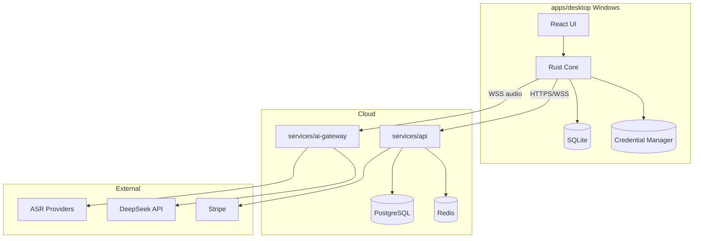

---

## 14. Sequence Diagrams

### 14.1 Voice recording

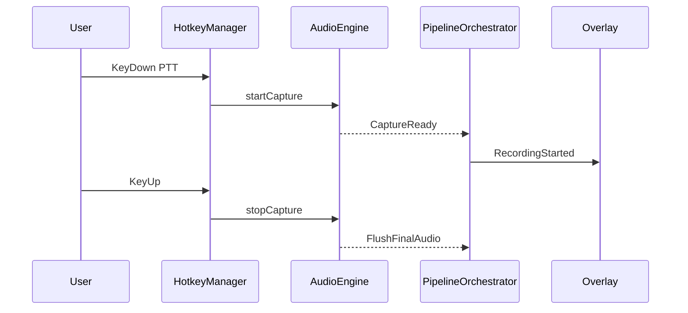

### 14.2 Speech recognition

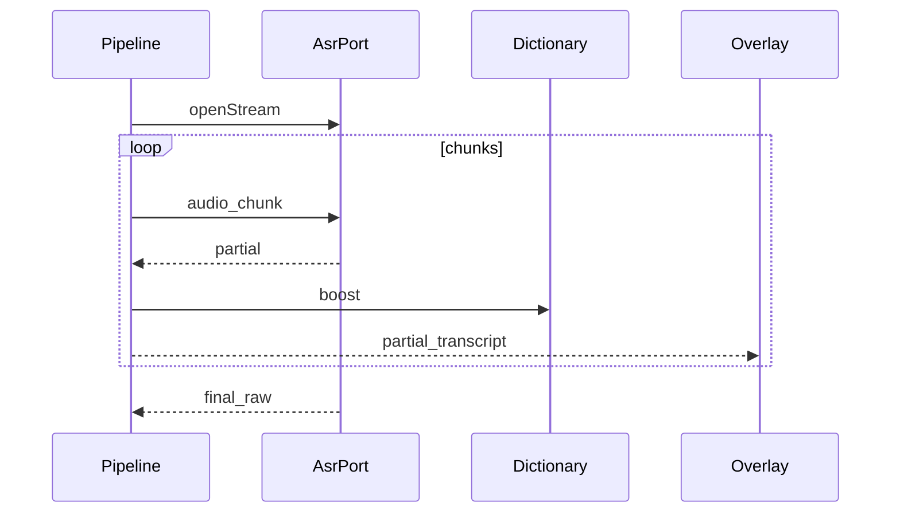

### 14.3 AI processing

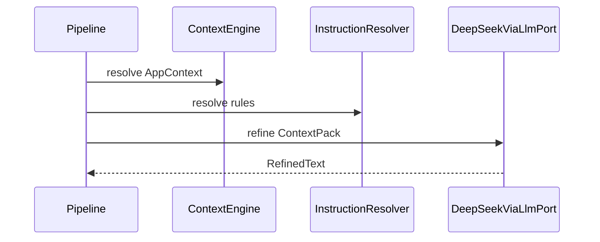

### 14.4 Text insertion

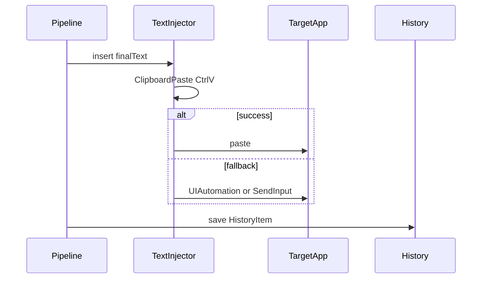

### 14.5 Context detection

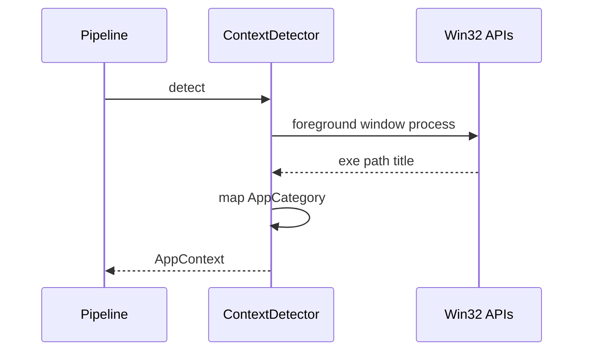

---

## 15. ER Diagram

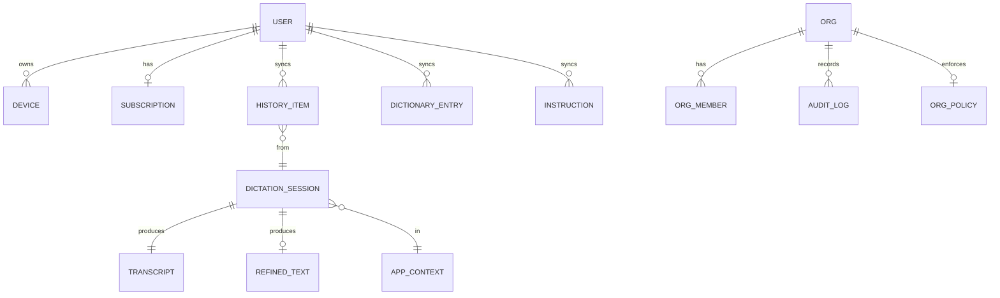

---

## 16. Dependency Graph

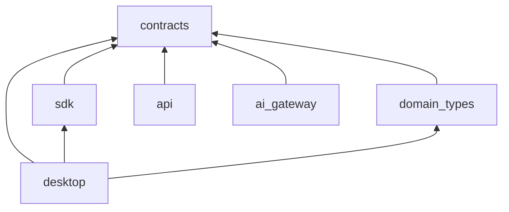

Запрет: desktop не импортирует исходники api — только HTTP через sdk/contracts.

---

## 17. Security Architecture

- Secrets: Windows Credential Manager; не plaintext в SQLite
- At rest: encryption sensitive local fields; cloud secrets via KMS
- Transit: TLS 1.3
- AuthZ: RBAC; org policy для privacy lock
- Permissions: mic + UI Automation явно
- Audit: Enterprise append-only
- ZDR: без persistence audio/transcript на сервере
- Refine path: без tool-calling (защита от prompt injection в транскрипте)

---

## 18. Performance Architecture

- Cold start shell &lt;500 ms; lazy-init non-critical
- Audio hot path в Rust, zero-copy ring buffer
- UI не на audio/ASR thread
- Warm WebSocket в cloud modes
- Backpressure: drop non-final UI updates; audio по политике буфера
- Resource monitor: деградация DSP при высокой CPU

---

## 19. MVP Development Plan

**MVP = Windows only:** PTT, cloud ASR, DeepSeek refine, inject, local history, global instructions, basic dictionary, overlay.

| Phase | Scope | Exit criteria |
|-------|-------|---------------|
| M0 | Monorepo, Tauri Windows shell, CI, contracts | shell start &lt;500 ms |
| M1 | Capture &lt;50 ms, PTT, overlay | record/stop stable |
| M2 | Streaming ASR via port | partial &lt;300 ms P50 |
| M3 | DeepSeek refine + clipboard inject | E2E &lt;800 ms P50 |
| M4 | Context categories + dictionary | IDE vs Slack differs |
| M5 | History, settings, auth stub | funnel install → first dictation |
| M6 | Permissions UX, crash recovery, updater | 24h soak без hang |

---

## 20. Version 2 Roadmap

- Local / Hybrid + Ollama / Whisper.cpp
- Per-app instructions; team dictionaries
- Hands-free; multi-ASR router; BYOK
- Encrypted cloud sync
- Screen-aware context (opt-in)
- **macOS** desktop
- iOS / Android / Web companion
- Proprietary refine model — только после стабильного provider layer

---

## 21. Enterprise Scaling Plan

- SSO/SAML + SCIM; org-wide privacy lock
- Central dictionaries/instructions; DLP hooks
- Regional residency; ZDR; audit export
- Dedicated gateway / VPC
- Quotas, seats, MSA billing
- HA gateway, provider failover (ASR; LLM остаётся DeepSeek пока нет ADR на второго)
- MDM: msi, managed preferences

---

## 22. Technical Risks

| Risk | Mitigation |
|------|------------|
| Windows injection flaky | Multi-strategy injector + per-app profiles |
| ASR latency | Warm connections, failover ASR, partial UX |
| DeepSeek alters code/meaning | Strict system prompt + validators + raw ASR fallback |
| DeepSeek outage / rate limit | Retry, queue, degrade to raw transcript |
| Hotkey conflicts | Detect + remapping UX |
| Privacy | Transparent modes; ZDR enterprise |
| Tauri Windows gaps | Early spike M0: hotkeys + inject |
| Cloud cost | Metering, cheaper refine tier, short context |

---

## 23. Development Priorities

1. Надёжность capture → inject (Windows)  
2. Latency budgets  
3. ASR quality + dictionary  
4. DeepSeek refine + guardrails  
5. Context-aware instructions  
6. Privacy modes  
7. Sync  
8. macOS  
9. Mobile  
10. Enterprise  

---

## 24. ADR index

Полные записи: [decisions.md](./decisions.md).

| ID | Тема |
|----|------|
| ADR-002 | Tauri v2 + React + TS |
| ADR-003 | FastAPI backend за `/v1` contracts |
| ADR-004 | pnpm + Turborepo monorepo |
| ADR-005 | Provider ports ASR/LLM/Signal |
| ADR-006 | Local-first SQLite |
| ADR-007 | Privacy: local / hybrid / cloud |
| ADR-008 | Windows injection clipboard-first |
| ADR-009 | Refine guardrails |
| ADR-010 | ai-gateway отдельно от api |
| ADR-011 | Stack conventions (React/Zustand/FastAPI) |
| ADR-012 | Windows-first MVP |
| ADR-013 | LLM = DeepSeek only (no Claude/Anthropic) |

---

## Hotkey modes (product)

- Push To Talk (MVP)
- Toggle Recording (V1)
- Hands Free (V1)

## Supported target apps (context mapping)

Cursor, VS Code, JetBrains, Chrome, Slack, Discord, Telegram, Word, Outlook, Gmail, Notion, Obsidian — и любое текстовое поле через injection fallback.
